<div align="center">

# Spartan Tweet Cruncher

**COMP90024 Cluster and Cloud Computing, Assignment 1, revived.**
An MPI program that crunched 9.09 million geotagged tweets on the University of Melbourne's Spartan HPC,
brought back as an interactive site: the original results, the scaling story, and the same algorithm running
on your own CPU cores in the browser.

[](https://github.com/rNLKJA/Twitter-Data-Analysis-with-HPC/actions/workflows/ci.yml)
[](https://nextjs.org/)
[](https://www.typescriptlang.org/)
[](./coursework)
[](./LICENSE)

**Live demo:** [comp90024-spartan-twitter.vercel.app](https://comp90024-spartan-twitter.vercel.app)

</div>

## Showcase

<p align="center">
  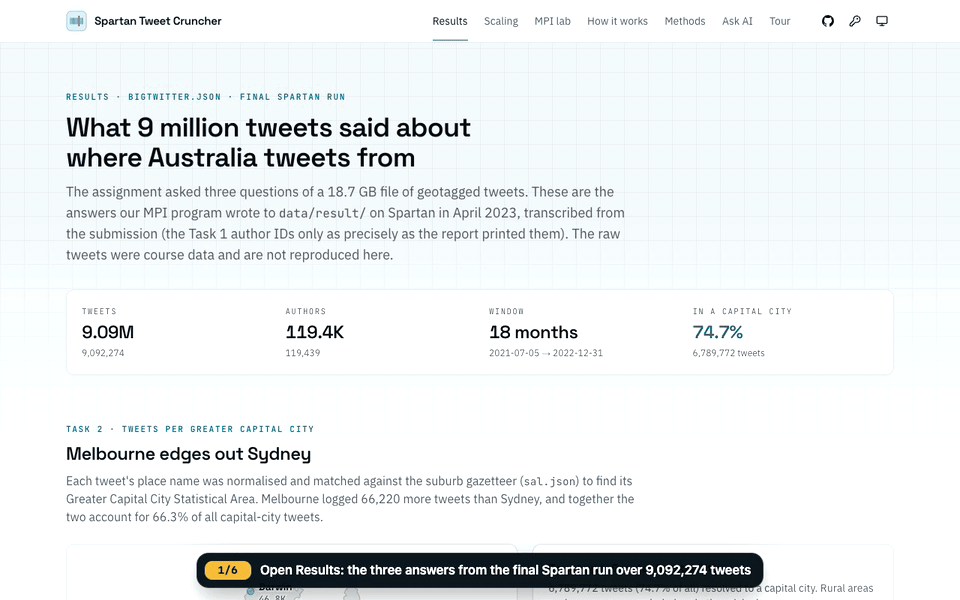
</p>

**[Take the guided tour →](https://comp90024-spartan-twitter.vercel.app/tour)** Three captioned walkthrough videos and every screenshot below,
recorded from a production build of the site (`pnpm build && pnpm start`) by a reproducible Playwright script
([`web/e2e/showcase.spec.ts`](web/e2e/showcase.spec.ts), run with `pnpm showcase` in `web/`) that also checks
each step: the published numbers, the fitted serial fraction, an 8-rank run matching the 1-rank baseline, a complete
benchmark. Inputs are seeded, so the same file and settings come back every time; timings are measured live and vary by
machine. No real API key appears anywhere: the AI steps use a placeholder key and a mocked reply, labelled on screen.

### Key features

| | |
| --- | --- |
| 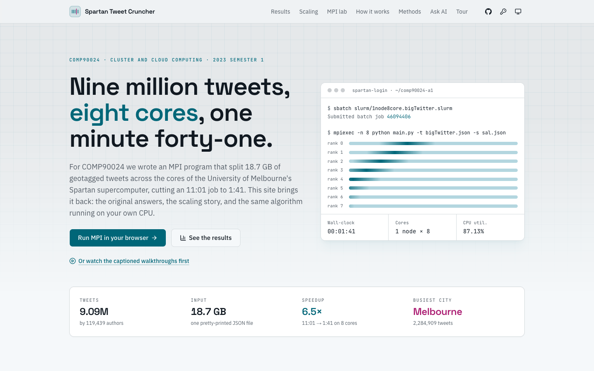<br>**Landing page.** Nine million tweets, eight cores: the project, its answers and its speedup. | 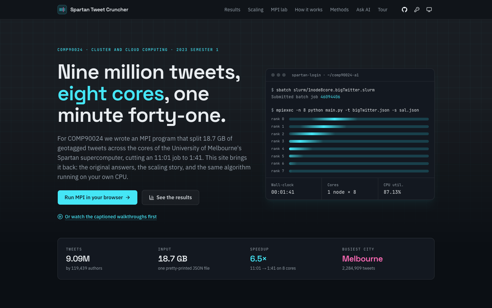<br>**Landing page, dark mode.** The same page in dark mode. |
| 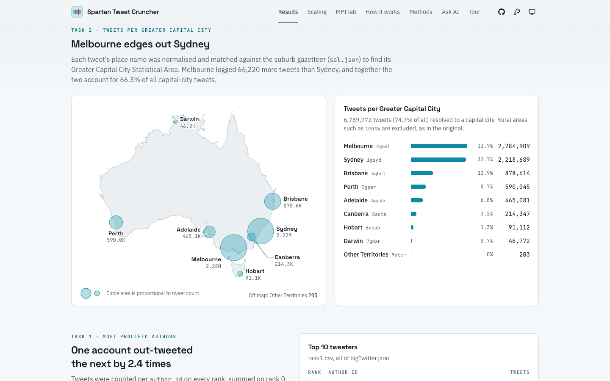<br>**Results: capital cities.** Task 2 on a map of Australia, with the per-city table. | 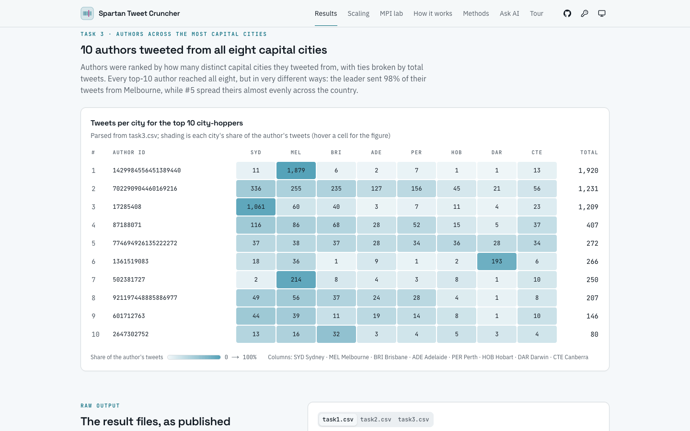<br>**Results: authors.** Task 3's city-hoppers heatmap: each cell is a city's share of an author's tweets. |
| 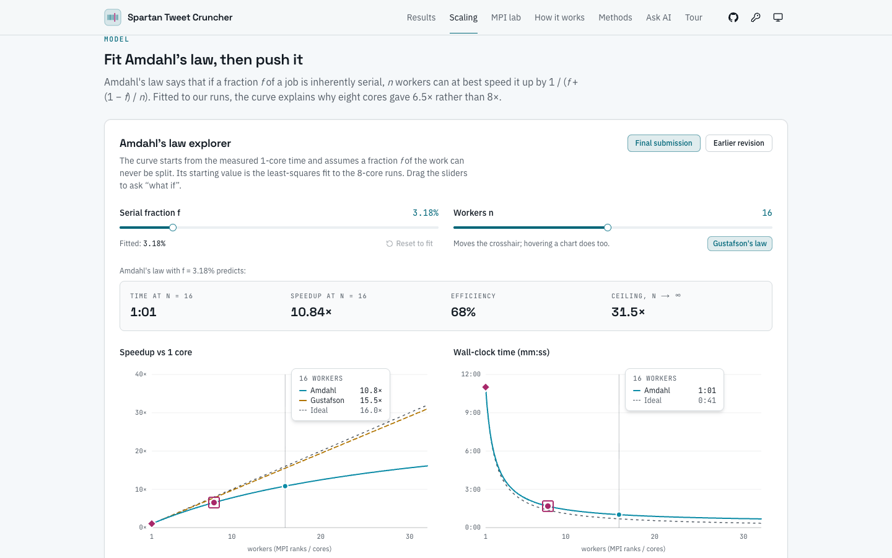<br>**Scaling lab.** Amdahl's law fitted to the Spartan jobs, with sliders for f and n. | 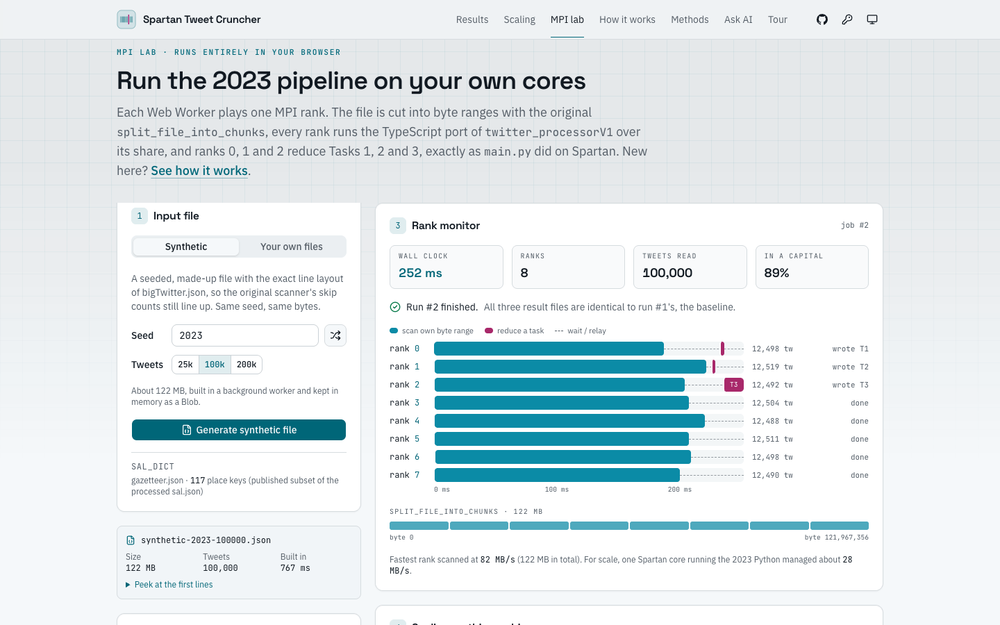<br>**MPI in your browser.** 8 Web Worker ranks over a seeded synthetic file: scan, reduce, check. |
| 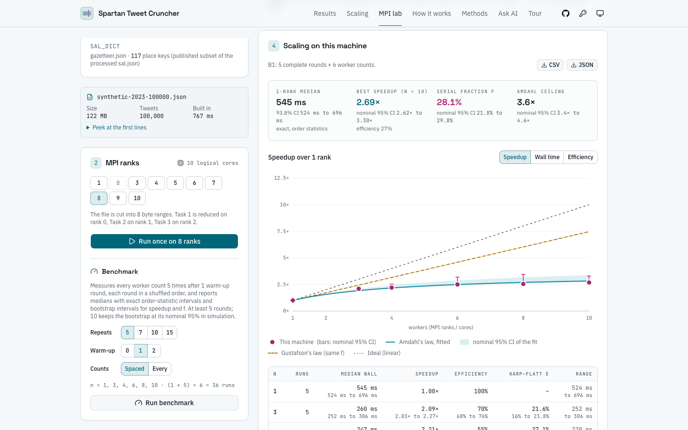<br>**Benchmark with intervals.** Repeated, shuffled rounds: bootstrap CIs for speedup and the fitted f. | 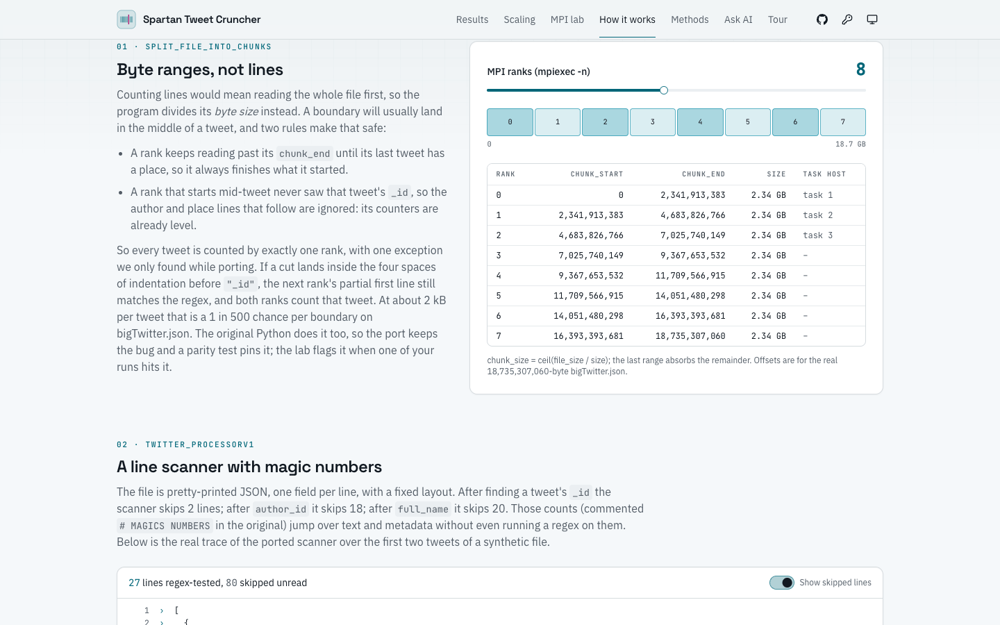<br>**How it works.** Byte-range chunking on the real 18.7 GB file size, step by step. |
| 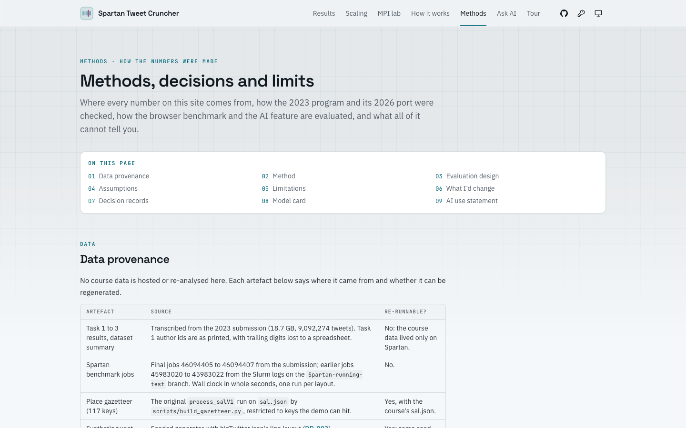<br>**Methods.** Provenance, evaluation design, limitations, decision records and AI use. | <br>**Bring your own key.** AI settings: Anthropic by default, the key stays in this browser. |
| 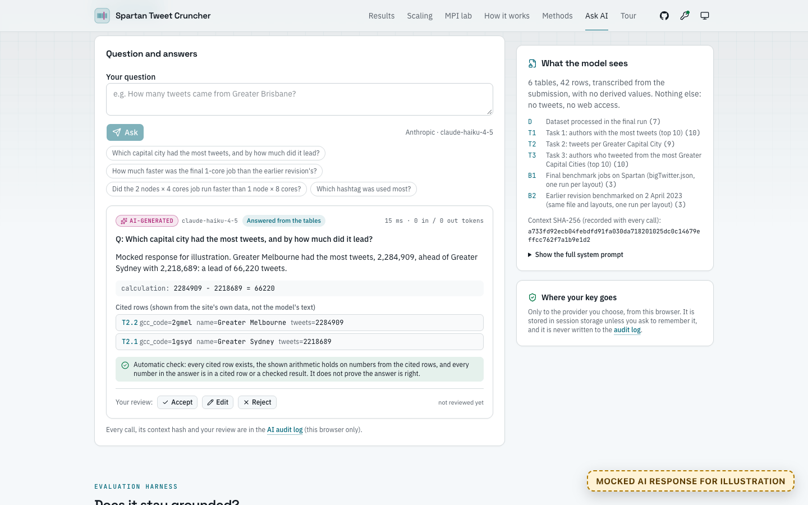<br>**Ask the results (mocked reply).** A mocked answer for illustration: cited rows, automatic check, your review. | 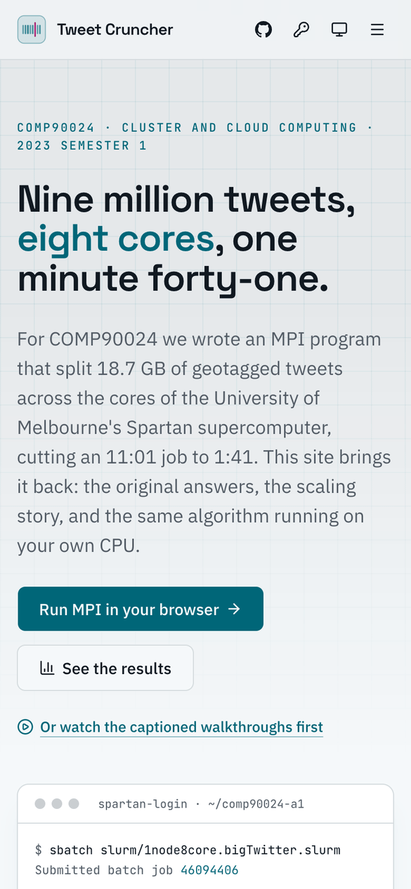<br>**Mobile: landing.** The landing page at 390 px. |
| 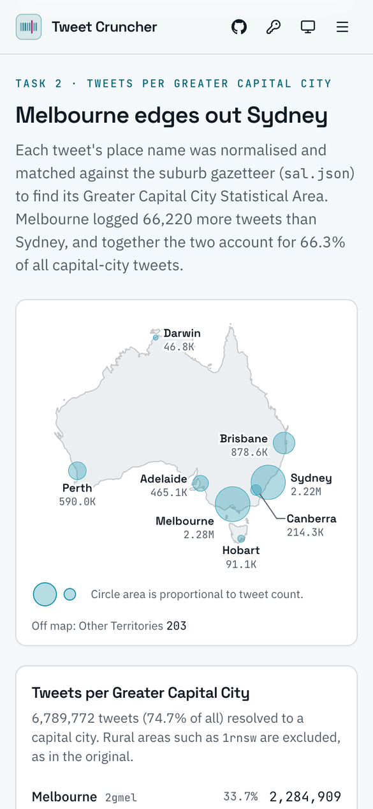<br>**Mobile: results.** The Task 2 map and table on a phone. | 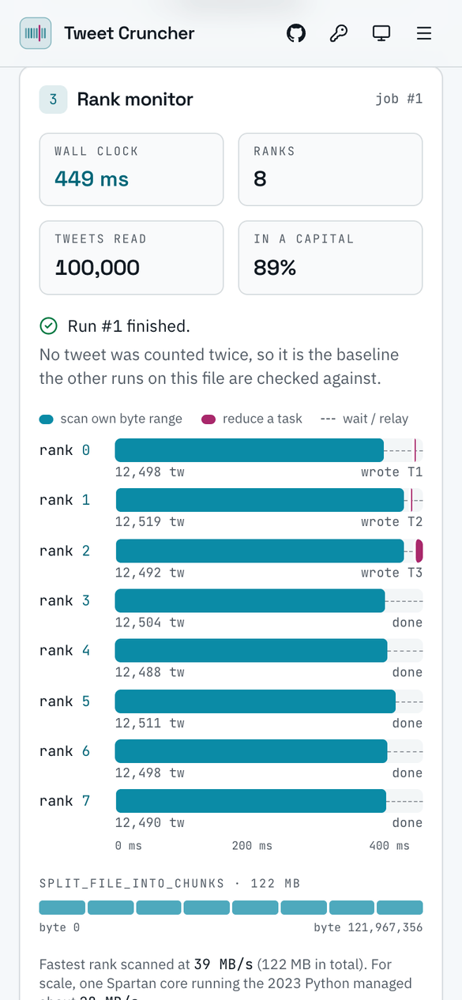<br>**Mobile: MPI lab.** A run on 8 ranks, on a phone. |
| **[More on /tour →](https://comp90024-spartan-twitter.vercel.app/tour)** Every screenshot in a lightbox, and the three videos with captions and transcripts. | |

### Workflow walkthrough

The numbered steps are the captions shown on screen. The videos on [/tour](https://comp90024-spartan-twitter.vercel.app/tour) play in real time with
captions; the GIFs here are shortened (waits on the app and scrolls are cut, and they play at 1.25× speed).

#### 1. The results (`/results`)

The dashboard of the three answers the MPI program wrote on Spartan in 2023: tweets per capital city on a map, the top tweeters, the city-hoppers heatmap and the raw result files.

Setup: No input needed: every number is transcribed from the 2023 submission. (The GIF at the top of this section.)

1. Open Results: the three answers from the final Spartan run over 9,092,274 tweets
2. Task 2: tweets per Greater Capital City, on a map of Australia and in a table
3. Hover a city to highlight it on the map and in the table: Melbourne edges out Sydney
4. Task 1: the ten most prolific authors, ties sharing a place
5. Task 3: ten authors tweeted from all eight capitals; each cell is a city's share
6. The three result files, laid out in main.py's format

#### 2. Scaling lab (`/scaling`)

The Spartan benchmark jobs, their speedup and Karp–Flatt serial fraction, and an Amdahl's law explorer fitted to the measured runs, with the serial-fraction slider dragged to ask “what if”.

Setup: Final submission's jobs 46094405–07 (1 × 1, 1 × 8 and 2 × 4 cores, one run each); the explorer starts from the least-squares fit.

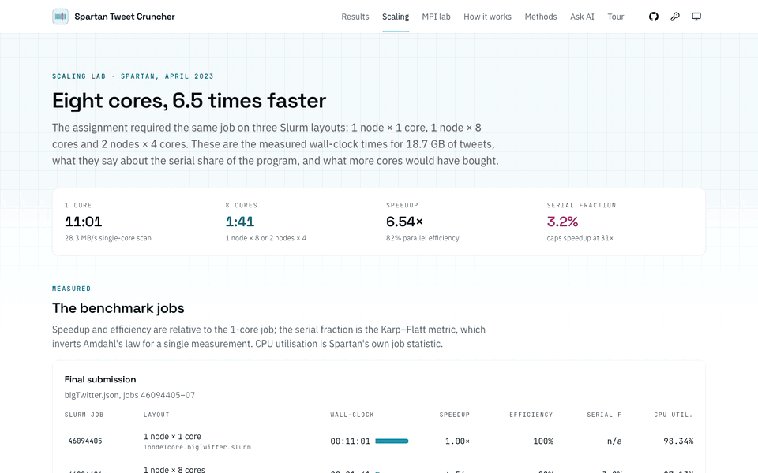

1. Open Scaling: the 1 × 1, 1 × 8 and 2 × 4-core Spartan jobs, one run each
2. Speedup, efficiency and the Karp–Flatt serial fraction for every job
3. Amdahl's law explorer: the serial fraction fitted to the 8-core runs, about 3.2%
4. Drag the serial fraction f: the curve, the predictions and the ceiling follow
5. Drag the workers n: predicted time and speedup at that core count
6. Gustafson's law for contrast: the same f if the input grew with the cores
7. Reset to the fit: one run per layout, so 3.2% is a point estimate with no interval

#### 3. MPI in your browser (`/lab`)

A seeded synthetic file crunched by the ported algorithm with one Web Worker per MPI rank, a repeated benchmark across worker counts with interval estimates, then the optional bring-your-own-key question answering, shown with a mocked reply (no real key is used).

Setup: Seed 2023, 100,000 tweets. Benchmark: 1 warm-up and 5 timed rounds per worker count, round order seed 2023, bootstrap seed 90024; worker counts 1, 3, 4, 6, 8 and 10 on the 10-core recording machine (2 is skipped: the original cannot run on 2 ranks). Ask: a placeholder key and a mocked reply.

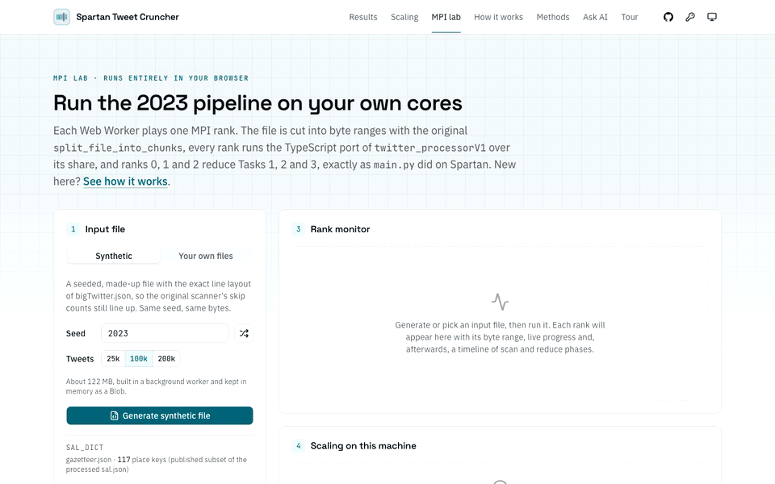

1. Open the MPI lab: one Web Worker per MPI rank, running the ported algorithm
2. Generate the seeded synthetic file: seed 2023, 100,000 tweets in bigTwitter.json's layout
3. Run on 1 rank first: the clean baseline, like the 1 node × 1 core job
4. Run on 8 ranks: each scans its own byte range, then ranks 0, 1 and 2 reduce the tasks
5. Same three result files as the 1-rank baseline; the answers from the task ranks
6. Benchmark: 5 timed rounds per worker count after a warm-up, in shuffled order
7. Speedup with nominal 95% bootstrap intervals, the fitted Amdahl curve and its band
8. Per worker count: median time with an exact interval, efficiency and Karp–Flatt
9. Ask the results: optional, answered only from the result tables, with your own key
10. AI settings: the key stays in this browser and goes only to the provider
11. For this demo: a placeholder key, never a real one; provider calls are intercepted
12. A mocked answer, labelled AI-generated, with cited rows and an automatic check
13. Accept it: the review is recorded in the AI audit log, with JSON and CSV export
14. Forget key: the placeholder is removed from this browser

Steps 11 to 13 show a **mocked AI response for illustration**: a placeholder key is typed, every request to the provider is intercepted in the browser, and the reply is written by the tour script (its text starts “Mocked response for illustration.”). No model was called.

## What the assignment asked

Each pair had to write a parallel program for Spartan that reads a very large Twitter dataset
(`bigTwitter.json`, 18.74 GB) together with a gazetteer of Australian suburbs (`sal.json`), and answers three
questions:

1. Which authors tweeted the most?
2. How many tweets were made in each Greater Capital City?
3. Which authors tweeted from the most different Greater Capital Cities?

The program had to run on 1 node × 1 core, 1 node × 8 cores and 2 nodes × 4 cores, and the report had to
explain the timings.

## What we built (2023)

A Python 3.7 + `mpi4py` program (in [`coursework/`](./coursework)) that never parses the file as JSON:

- **Split** the file into equal byte ranges, one per MPI rank (`split_file_into_chunks`).
- **Scan** each range line by line with three regular expressions (`_id`, `author_id`, `full_name`), skipping
  2, 18 and 20 lines after each hit to jump over the fields it does not need (`twitter_processorV1`).
- **Match** each place name to a Greater Capital City by normalising it and looking its word n-grams up in a
  dictionary built from `sal.json`.
- **Gather** three small partial tables onto ranks 0, 1 and 2, which reduce Task 1, 2 and 3 and write one CSV
  each.

### Results on `bigTwitter.json` (9,092,274 tweets, 119,439 authors, 2021-07-05 to 2022-12-31)

| Slurm job | Layout | Wall-clock | Speedup | CPU utilisation |
| --- | --- | ---: | ---: | ---: |
| 46094405 | 1 node × 1 core | 11:01 | 1.00× | 98.34% |
| 46094406 | 1 node × 8 cores | 1:41 | 6.54× | 87.13% |
| 46094407 | 2 nodes × 4 cores | 1:41 | 6.54× | 87.75% |

Fitting Amdahl's law to these runs gives a serial fraction of about 3.2%, a ceiling near 31×. That is a point
estimate: one run per layout, and both multi-core layouts used 8 cores, so there is no spread to put an interval
on (whole-second timing alone moves it between 3.08% and 3.28%). The revival's browser benchmark repeats every
configuration instead; see [Methods](https://comp90024-spartan-twitter.vercel.app/methods).

- **Task 1:** the most prolific account posted 68,477 tweets, 2.4 times the runner-up.
- **Task 2:** Melbourne (2,284,909) edged out Sydney (2,218,689); 74.7% of all tweets resolved to a capital city.
- **Task 3:** all ten top authors tweeted from all eight capital cities.

Every table is on the [Results](https://comp90024-spartan-twitter.vercel.app/results) page, transcribed from the
submission. The Task 1 author IDs are shown as the report printed them: they passed through a spreadsheet, which
kept only 15 significant digits, so their trailing digits are lost (the counts are exact).

## What the revival adds (2026)

| Route | What it does |
| --- | --- |
| `/` | Plain-language overview, key numbers, about the project |
| `/results` | Task 2 map of Australia + table, Task 1 top tweeters, Task 3 heatmap, and the three result CSVs in `main.py`'s format (Task 1 author IDs as published) |
| `/scaling` | The final and an earlier set of Spartan benchmark jobs, speedup, efficiency, Karp–Flatt serial fraction, and an Amdahl's law explorer fitted to the measured runs |
| `/lab` | **MPI in your browser.** Generates a seeded synthetic file with the exact line layout of `bigTwitter.json`, splits it with the original chunking, and processes it with one Web Worker per rank. Live per-rank progress, a scan/reduce timeline, the three answers, a check of every run's output against a clean baseline run (one that counted no tweet twice), and a **benchmark** that measures speedup on your machine with intervals (below). You can also load your own course-format files locally |
| `/how-it-works` | Interactive chunk explorer on the real file size, a line-by-line trace of the scanner, the place matcher step by step, and the gather/reduce design |
| `/methods` | Data provenance, method, evaluation design, assumptions, limitations and what I'd change; five decision records (`/methods/decisions/…`), the model card (`/methods/model-card`) and the AI use statement |
| `/ask` | **Optional, bring your own key.** Ask questions of the original result tables; answers cite table rows, are checked automatically, labelled AI-generated and reviewed by you. Includes a 24-question grounding evaluation |
| `/ai-log` | The AI audit log kept in your browser, with JSON and CSV export |

### Measurement rigour (2026 upgrade)

The lab's benchmark runs every worker count R times (10 by default, at least 5) after a discarded warm-up round, each
round in a seeded random order so drift is spread across worker counts. It reports, per worker count, the median wall
time with its **exact order-statistic interval** (distribution-free; its true coverage is shown, for example 97.9% at
10 rounds), speedup, efficiency and the Karp–Flatt fraction with **percentile bootstrap intervals** (2,000 resamples of
whole rounds, seed 90024, labelled nominal 95%), fits **Amdahl's serial fraction** by least squares with an interval
from the same resamples, overlays **Gustafson's law** for contrast, and exports the raw samples, seeds and environment
as CSV or JSON. A seeded simulation checks how often each interval really covers the truth (`pnpm coverage-sim` in
`web/`; results in [DR-004](./docs/decisions/DR-004-benchmark-protocol.md)). The statistics live in
[`web/src/lib/stats`](./web/src/lib/stats) and [`web/src/lib/lab/benchmark.ts`](./web/src/lib/lab/benchmark.ts) and are
unit-tested against reference values from numpy, scipy and statsmodels
([`scripts/stats_reference.py`](./scripts/stats_reference.py), `uv run scripts/stats_reference.py`, which replays the
seeded bootstrap draw for draw) and from base R ([`scripts/stats_reference.R`](./scripts/stats_reference.R),
`Rscript scripts/stats_reference.R`). On one development laptop (Apple M4, 4 performance and 6 efficiency cores) the
browser's f came out between about 21% and 25% across sessions, with speedup flattening near 3× (details and caveats in
[DR-004](./docs/decisions/DR-004-benchmark-protocol.md)).

### Methods, decision records and model card

[`docs/`](./docs) holds the [model card](./docs/model-card.md), the [AI use statement](./docs/ai-use-statement.md) and
the decision records, all rendered under `/methods`:

| Record | Decision |
| --- | --- |
| [DR-001](./docs/decisions/DR-001-byte-range-chunking.md) | Split the file by byte ranges, not by lines (and the two boundary bugs that come with it) |
| [DR-002](./docs/decisions/DR-002-gather-strategy.md) | Pre-aggregate on every rank, then send to three task ranks (and why the reductions did not overlap) |
| [DR-003](./docs/decisions/DR-003-synthetic-data-design.md) | A seeded synthetic file with `bigTwitter.json`'s exact line layout |
| [DR-004](./docs/decisions/DR-004-benchmark-protocol.md) | Repeated, shuffled benchmark rounds with intervals whose coverage is checked |
| [DR-005](./docs/decisions/DR-005-grounded-answers.md) | Grounded, cited, audit-logged answers with your own key |

The site reads a copy of these files in `web/content/docs/` (the Vercel build only sees `web/`); after editing `docs/`,
run `pnpm sync-docs` in `web/`. A test fails if the copies drift.

### Optional AI: bring your own key

`/ask` lets a language model answer questions **only** from the transcribed result and benchmark tables (shown in
full on the page with their SHA-256). The model must cite the row ids it used, write out any arithmetic and decline
when the tables cannot answer; every answer is checked (cited rows exist, the shown arithmetic is re-done on numbers
from the cited rows, and every number in the answer is in a cited row or a checked result), labelled
**AI-generated**, and left for you to accept, edit or reject.

- **Your key, your browser.** Open **AI settings** (the key icon in the header), choose Anthropic (default: Claude
  Haiku 4.5, or Claude Sonnet 5.5) or OpenAI (any model id), and paste your own key. It is kept in session storage
  (local storage only if you tick "remember on this device"), sent only from your browser to that provider
  (Anthropic with the `anthropic-dangerous-direct-browser-access` header), and never sent to this site, which is
  static and has no server. "Forget key" removes it.
- **Audit log.** Every call is appended to an IndexedDB log in your browser: time, feature, provider, model requested
  and model served, request settings (token limit, effort, fallback, system-prompt hash), prompts (never the key),
  context hash, output or error, latency, token usage and every review decision in order. View, export (JSON/CSV) or
  clear it at [`/ai-log`](https://comp90024-spartan-twitter.vercel.app/ai-log).
- **Evaluation harness.** 24 fixed questions (14 answerable, 10 not, including an identity probe and a prompt
  injection) with an answer key computed in code from the same tables. Every item a run reached is scored (a failed
  call counts as a fail), with Wilson 95% intervals for each rate and for the call-error rate; paired comparison of
  two runs (paired bootstrap interval and exact McNemar test) warns when their request settings differ; CSV/JSON
  export. No scores are published
  here, by design ([DR-005](./docs/decisions/DR-005-grounded-answers.md)).
- The design is informed by the Australian Government's responsible-AI policy, the EU AI Act's transparency
  principles and the NIST AI RMF; it is not a compliance claim. The site works fully without a key.

Client code: [`web/src/lib/ai`](./web/src/lib/ai) (typed provider adapters, zod-validated structured output, audit
store); tests mock `fetch`, so no test calls a real API.

### Faithful port, verified against the original

The browser runs a TypeScript port of the original algorithm in [`web/src/lib/cruncher`](./web/src/lib/cruncher),
magic numbers and quirks included. The original Python in `coursework/` (analysis logic as submitted) is run
outside Spartan by
[`scripts/run_original.py`](./scripts/run_original.py) (mpi4py stubbed, ranks re-enacted in `gather_task_tdf`
order, 2023 dependency pins) to produce reference outputs. The Vitest suite then checks that the port gives:

- identical per-tweet records (id, author, normalised place, city) and per-rank tweet counts for 1, 3, 4 and 7 ranks;
- identical `task1.csv`, `task2.csv`, `task3.csv` and `task3_1.csv`;
- the same crash where the original crashes: when a chunk starts inside a multi-byte UTF-8 character, the
  original's strict `line.decode()` raises `UnicodeDecodeError` and so does the port, with the same message
  (17 and 29 ranks on a 400-tweet file with non-ASCII text);
- the same `sal.json` dictionary (keys, codes and insertion order) on a sample;
- the same resolution for every place in the demo vocabulary as against the full `sal.json`.

Locally, with the course files (not committed), the full 16,616-key dictionary and the course's
`tinyTwitter.json` (1, 3, 4 and 8 ranks) also match exactly, as does a 122 MB synthetic file at 1, 6, 8 and 9 ranks.

### A bug found while porting

If a chunk boundary lands inside the four spaces of indentation before `"_id"`, the next rank's partial first
line still matches the `_id` regex while the previous rank reads that line in full, so **both ranks count the
tweet**. It is about a 1 in 500 chance per boundary on `bigTwitter.json`. The original Python does it (verified:
400 tweets read as 401 at 27 and 39 ranks), so the port keeps it, a parity test pins it, and the lab explains it
when one of your runs hits it.

Two more ways the 2023 code can fail are kept as well: a rank whose chunk starts inside a multi-byte character
raises `UnicodeDecodeError` (the lab reports it as that rank's error), and a file in which no tweet resolves to a
capital city makes Task 3 stop with a polars `ComputeError` (the lab shows the empty answer and says so).

## Tech stack

| | 2023 original | 2026 revival |
| --- | --- | --- |
| Language | Python 3.7 | TypeScript (strict) |
| Parallelism | mpi4py on Open MPI, Slurm on Spartan | Web Workers as ranks; the page relays partial tables like MPI send/recv |
| Data | polars, pandas, NumPy | framework-free ports in `web/src/lib`, Vitest unit and parity tests |
| UI | CSV files and a report | Next.js 16 (App Router, static), React 19, Tailwind CSS v4, shadcn/ui, lucide, next-themes, hand-rolled SVG charts, d3-geo + Natural Earth for the map, react-markdown for the docs |
| Statistics | | seeded percentile bootstrap, Wilson intervals, exact McNemar, least-squares Amdahl fit, verified against numpy/scipy/R |
| AI (optional) | | bring-your-own-key, browser-direct: Anthropic SDK or OpenAI Chat Completions, zod-validated structured output, IndexedDB audit log |
| Tooling | | pnpm, ESLint, Prettier, GitHub Actions, uv for the Python scripts |

## Repository structure

```
.
├── README.md
├── LICENSE
├── .github/workflows/ci.yml     lint, typecheck, test and build the web app
├── coursework/                  the original 2023 submission (see coursework/README.md)
│   ├── main.py
│   ├── scripts/                 twitter_processor.py, sal_processor.py, mpi.py, utils.py, ...
│   ├── slurm/                   the three benchmark jobs
│   └── _archive/                the README as submitted
├── docs/                        model card, AI use statement, decision records (rendered under /methods)
├── scripts/                     Python (uv) scripts that run the ORIGINAL code to make web artefacts
│   ├── _original.py             loads coursework/scripts/* as they are, outside Spartan
│   ├── run_original.py          re-enacts main.py rank by rank, dumps results as JSON
│   ├── build_gazetteer.py       builds web/public/data/gazetteer.json
│   ├── stats_reference.py       numpy/scipy/statsmodels reference values for the statistics tests
│   └── stats_reference.R        the same checks in base R
└── web/                         the Next.js app (Vercel root)
    ├── content/docs/            synced copy of docs/ for the build (pnpm sync-docs)
    ├── public/data/gazetteer.json
    ├── scripts/                 write-synthetic.ts, run-pipeline.ts: TS counterparts for parity checks. They
    │                            live with the web package (not in root scripts/) because they import its port
    │                            and run with its tsx: `pnpm gen:synthetic`, `pnpm run:pipeline`
    └── src/
        ├── app/                 /, /results, /scaling, /lab, /how-it-works, /methods, /ask, /ai-log, ...
        ├── components/          ui/ (shadcn), layout/, charts/, results/, scaling/, lab/, how/, home/, ai/, methods/
        ├── hooks/               use-mpi-lab (worker orchestration and the benchmark), use-element-width
        ├── lib/                 cruncher/ (the port), synth/, lab/ (runs, benchmark), stats/, ai/, content/, data/, ...
        └── workers/             rank.worker.ts (one MPI rank), synth.worker.ts (file generator)
```

## Local development

Requirements: Node 20.9+ and pnpm 10.

```bash
cd web
pnpm install
pnpm dev            # http://localhost:3000
pnpm lint && pnpm typecheck && pnpm test && pnpm build
pnpm sync-docs      # after editing ../docs
```

No API key is needed to build, test or run the site. The AI tests mock every network call.

## Data artefacts and how they are made

No course data is committed or served. The site uses:

| Artefact | Made by | Notes |
| --- | --- | --- |
| `web/src/lib/data/original.ts` | transcribed | Final results and benchmark numbers from the submission; earlier benchmarks from the Slurm logs on the `Spartan-running-test` branch |
| `web/public/data/gazetteer.json` | `scripts/build_gazetteer.py` | The original `process_salV1` + `normalise_location` run on `sal.json`, restricted to the keys any demo place name can hit (117 keys, 18 kB) |
| `web/src/lib/__fixtures__/*.json` | `scripts/run_original.py` | Outputs of the original Python on synthetic files (plain, and with non-ASCII text), used by the parity tests |
| Synthetic tweet files | `web/src/lib/synth` | Seeded, made-up tweets with `bigTwitter.json`'s line layout, generated in the browser |

To regenerate them you need `sal.json` from the course (place it anywhere, for example `scripts/.cache/`, which is
git-ignored) and [uv](https://docs.astral.sh/uv/):

```bash
# gazetteer for the web app
uv run scripts/build_gazetteer.py --sal scripts/.cache/sal.json

# parity fixture: the same synthetic file through the original Python and the port
(cd web && pnpm gen:synthetic --seed 2023 --tweets 400 --out ../scripts/.cache/synthetic-2023-400.json)
uv run scripts/run_original.py --twitter scripts/.cache/synthetic-2023-400.json \
  --sal scripts/.cache/sal.json --ranks 1 3 4 7 --records \
  --out web/src/lib/__fixtures__/parity-synthetic-2023-400.json
uv run scripts/run_original.py --twitter scripts/.cache/synthetic-2023-400.json \
  --sal scripts/.cache/sal.json --ranks 27 39 \
  --out web/src/lib/__fixtures__/parity-boundary-2023-400.json

# the same tweets with non-ASCII text: 17 and 29 ranks cut inside a character and crash
(cd web && pnpm gen:synthetic --seed 2023 --tweets 400 --non-ascii --out ../scripts/.cache/utf8-2023-400.json)
uv run scripts/run_original.py --twitter scripts/.cache/utf8-2023-400.json \
  --sal scripts/.cache/sal.json --ranks 1 4 17 29 --record-errors \
  --out web/src/lib/__fixtures__/parity-utf8-2023-400.json

# compare the port directly on any course-format file
(cd web && pnpm run:pipeline --twitter ../scripts/.cache/tinyTwitter.json \
  --sal ../scripts/.cache/sal.json --ranks 1 3 4 8 --out ../scripts/.cache/tiny.port.json)
```

The Python scripts declare their dependencies inline (PEP 723: Python 3.11, polars 0.16.16, pandas 1.5.3), so
`uv run` needs no other set-up.

## Credits

- **Sunchuangyu (Rin) Huang** ([@rNLKJA](https://github.com/rNLKJA)): 2023 co-author; 2026 revival
- **Wei Zhao**: 2023 co-author

Map outline from [Natural Earth](https://www.naturalearthdata.com/) via
[world-atlas](https://github.com/topojson/world-atlas) (public domain).

## Academic integrity

The original 2023 submission is preserved in [`coursework/`](./coursework) for reference. The assignment brief,
the course datasets and the written report are not reproduced here or on the site; the task is paraphrased. If
you are taking COMP90024, please do your own work.

## Licence

[MIT](./LICENSE)
